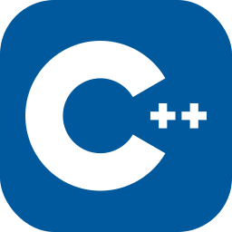

# PSE Traffic Simulator

## Description

### A traffic simulation made as a project for the course Project Software Engineering at the University of Antwerp.


The main goal of the course was to teach proper coding conventions. That's why all functionality has been properly
tested using the Google Test framework.

Some other conventions include using the prefix `g` for constants, using proper inheritance etc.

## Usage

### Input

Taking an `xml` file as input, the project reads the initial traffic state.

In this `xml` file, all roads, vehicles, vehicle generators, traffic lights, bus stops and crossroads are defined.

e.g.

```xml
<Road>
    <name>Broadway</name>
    <length>200</length>
</Road>
```

### Vehicle types

The project supports the following vehicle types:

- car
- bus
- priority vehicle:
    - fire truck
    - ambulance
    - police car

All these vehicle types have different characteristics, such as max speed, brake distance etc. <br/>
Some of them also have unique functionality, for example busses stop at bus stops and priority vehicle types run red lights.

### Output

There's two output formats supported.

#### Terminal

A simple `std::cout` which writes the information to the console.

e.g.

```cpp
Time: T+ 95.0848s
Vehicle 0
-> Road: Broadway
-> Position: 142.212
-> Speed: 7.00959
Vehicle 1
-> Road: Broadway
-> Position: 124.365
-> Speed: 4.02228
Vehicle 2
-> Road: Broadway
-> Position: 112.393
-> Speed: 1.66277
Vehicle 3
-> Road: Broadway
-> Position: 104.435
-> Speed: 0.0877223
```

#### Visualizer

The project also supports a GUI in the browser. The `html` file can be found in `./cmake-build-debug/out.html` after
running. Open this file in the browser for a visual overview.

## Behind the scenes

### Calculations

Using the fixed values:

| variable name        | value  |
|----------------------|--------|
| simulationTime       | 0.0166 |
| decelerationDistance | 50     |
| brakeDistance        | 15     |
| decelerationFactor   | 0.4    |

all other variables needed are calculated using physics formulas.

e.g. a vehicle that needs to stop has its acceleration decreased in the following manner:


## Tools used

- C++ 
- GoogleTest 
- HTML 
- PixiJS 
- JavaScript 
- JSON  
- XML 

## Course

Project Software Engineering University of Antwerp

## Credits

- Professor [Serge Demeyer](https://github.com/sergedemeyer) and assistant Brent van Bladel

- [Vehicle art used in visualization](https://pixeljoint.com/pixelart/81033.htm)

## License

Distributed under the _Creative Commons Attribution-NonCommercial-NoDerivatives 4.0 International License_.
See `License.md` for more information.